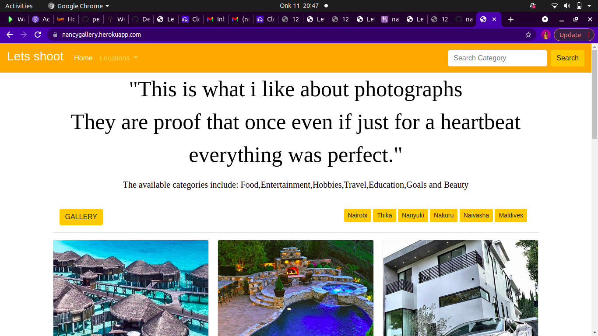
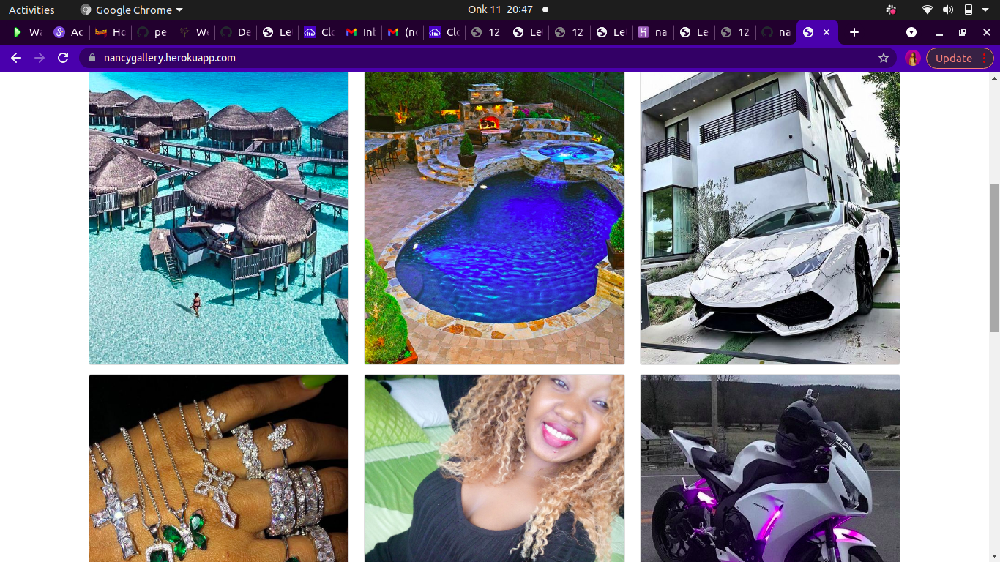
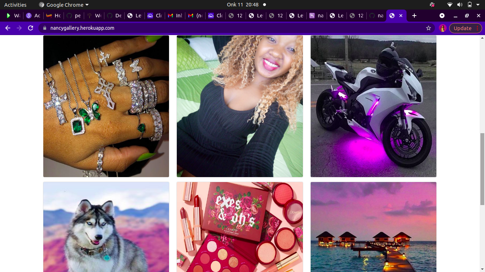
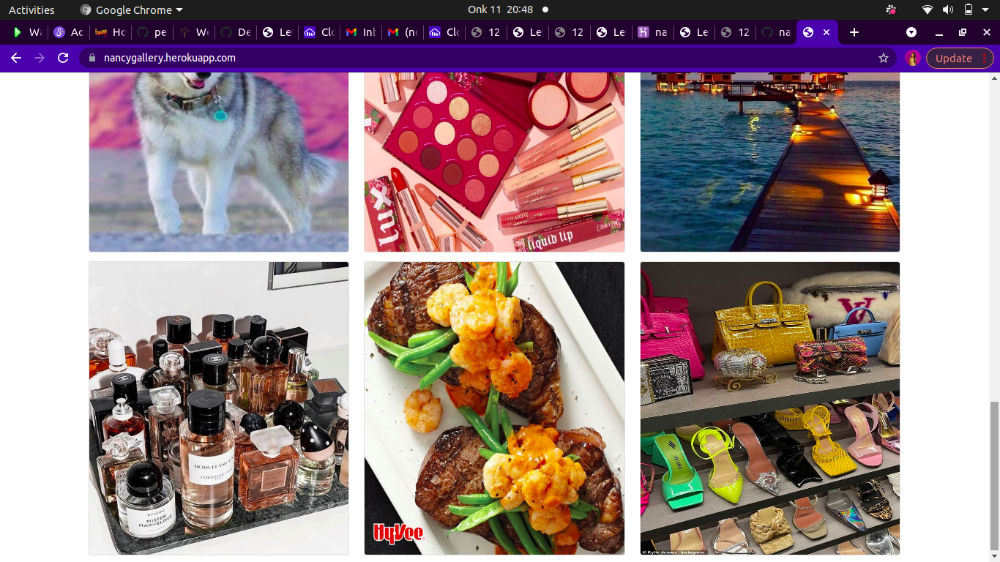

## PERSONAL GALLERY
## Developed by:Nancy Kigotho
## Description
* This is a Django application for my personal gallery that allows a user to upload images for other to see and be able to to share by coping the image link.
## User Story
* View different photos that interest them
* Click a single image to expand it and view the details of that photo
* Search for different categories
* Copy a link to the photo to share with my friends.
* View photos based on the location they were taken.
## Setup and Installation
To get the project .......

* Cloning the repository:
* Navigate into the folder and install requirements
* cd gallery pip install -r requirements.txt 
* Install and activate Virtual
 - python3 -m venv virtual - source virtual/bin/activate  
* Install Dependencies
* pip install -r requirements.txt 
* Setup Database
SetUp your database User,Password, Host then make migrate

python manage.py makemigrations    mygallery 
Now Migrate

python manage.py migrate 
Run the application
python manage.py runserver 
Running the application
python manage.py server 
Testing the application
python manage.py test 
Open the application on your browser.

## Technology used
* Python3.8
* Django 1.11.17
* Heroku
* PostgreSQL
* Bootstrap 4

## known Bugs
Thankfully i have no bugs.

## Screenshots

## Contact Information.
Incase you have any questions or you would want to work with me contact me via:
* Twitter:@mukuiyakigotho
* Email:nancykigotho14@gmail.com
## License
MIT licence